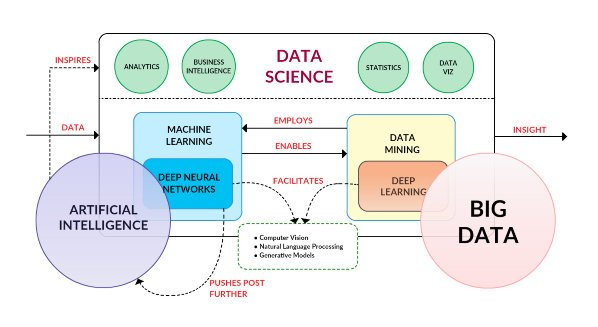

# Data Science/Machine and Deep Learning/AI useful links, docs, books, articles etc.

This is one of the best diagrams that try to solve the **Data Science** puzzle:

source: [KDNuggets](http://www.kdnuggets.com/2016/03/data-science-puzzle-explained.html/2)

## Index (alphabetical order)

* [AI - Artificial Inteligence](#ai)
* [Books](#books)
* [Deep Learning](#dl)
* [Data Science](#ds)
* [DataViz](#dv)
* [Machine Learning](#ml)
* [Python](#python)
* [Courses/Moocs](#co)

### Artificial Inteligence
* [Link 1](https://www.google.com)
* [Link 2](https://www.google.com)
---

### Books

1. [Python Data Science Handbook](https://jakevdp.github.io/PythonDataScienceHandbook/)

---

### Deep Learning
* [Link 1](https://www.google.com)
* [Link 2](https://www.google.com)
---

### Data Science links (non specific topics)
1. Data Science Venn Diagrams:
	+ http://www.kdnuggets.com/2016/10/battle-data-science-venn-diagrams.html
	+ http://drewconway.com/zia/2013/3/26/the-data-science-venn-diagram

2. 20 short tutorials all data scientists should read and practice - [http://www.datasciencecentral.com/profiles/blogs/17-short-tutorials-all-data-scientists-should-read-and-practice](http://www.datasciencecentral.com/profiles/blogs/17-short-tutorials-all-data-scientists-should-read-and-practice)

3. **What is Data Science?** [https://www.safaribooksonline.com/library/view/doing-data-science/9781449363871/ch01.html](https://www.safaribooksonline.com/library/view/doing-data-science/9781449363871/ch01.html)

4. Facebook Prophet: forecasting at scale - [https://research.fb.com/prophet-forecasting-at-scale/](https://research.fb.com/prophet-forecasting-at-scale/)
---

### DataViz
* [TED Talk **Hans Hosling - The best stats you've ever seen**](https://www.ted.com/talks/hans_rosling_shows_the_best_stats_you_ve_ever_seen/transcript?language=en#t-332112). This is one of the best presentation I had seen.
* [**https://www.GapMinder.org** - A tool from Hans Hosling foundation](https://www.gapminder.org/)
* Plotly - Examples - Matplotlib and Seaborn - [https://plot.ly/matplotlib/](https://plot.ly/matplotlib/)
* Overview of Python Visualization Tools [http://pbpython.com/visualization-tools-1.html](http://pbpython.com/visualization-tools-1.html)
---

### Machine Learning 
* [Link 1](https://www.google.com)
* [Link 2](https://www.google.com)
---

### Python
* Pandas Pivot Table Explained [http://pbpython.com/pandas-pivot-table-explained.html](http://pbpython.com/pandas-pivot-table-explained.html)
* Simple Graphing with IPython and Pandas [http://pbpython.com/simple-graphing-pandas.html](http://pbpython.com/simple-graphing-pandas.html)
* Common Excel Tasks Demonstrated in Pandas [http://pbpython.com/excel-pandas-comp.html](http://pbpython.com/excel-pandas-comp.html)
* Pandas Grouper and Agg Functions Explained [http://pbpython.com/pandas-grouper-agg.html](http://pbpython.com/pandas-grouper-agg.html)
* Pandas in a nutshell [http://kanoki.org/2017/07/16/pandas-in-a-nutshell/](http://kanoki.org/2017/07/16/pandas-in-a-nutshell/)
---

### Courses and training
* Statistics and Probability in Data Science using Python - **edX** [https://www.edx.org/course/statistics-probability-data-science-uc-san-diegox-dse210x?utm_source=sailthru&utm_medium=email&utm_campaign=newsletter_student_active_20170919](https://www.edx.org/course/statistics-probability-data-science-uc-san-diegox-dse210x?utm_source=sailthru&utm_medium=email&utm_campaign=newsletter_student_active_20170919)
